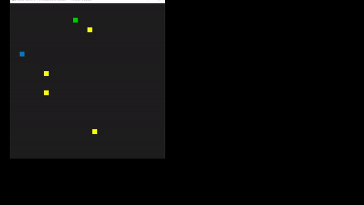

# CPPND: Capstone Snake Game Example

This is a repo forked from  Udacity for the Capstone project in the [Udacity C++ Nanodegree Program](https://www.udacity.com/course/c-plus-plus-nanodegree--nd213). 

In this project, I have extended the Snake Game to add some features, so that it incorporates some of the concepts that I have learned during the Nanodegree.

The yellow blocks are walls/ obstacles, the green one is the food.

## Dependencies for Running Locally
* cmake >= 3.7
  * All OSes: [click here for installation instructions](https://cmake.org/install/)
* make >= 4.1 (Linux, Mac), 3.81 (Windows)
  * Linux: make is installed by default on most Linux distros
  * Mac: [install Xcode command line tools to get make](https://developer.apple.com/xcode/features/)
  * Windows: [Click here for installation instructions](http://gnuwin32.sourceforge.net/packages/make.htm)
* SDL2 >= 2.0
  * All installation instructions can be found [here](https://wiki.libsdl.org/Installation)
  * Note that for Linux, an `apt` or `apt-get` installation is preferred to building from source.
* gcc/g++ >= 5.4
  * Linux: gcc / g++ is installed by default on most Linux distros
  * Mac: same deal as make - [install Xcode command line tools](https://developer.apple.com/xcode/features/)
  * Windows: recommend using [MinGW](http://www.mingw.org/)

## Basic Build Instructions

1. Clone this repo.
2. Make a build directory in the top level directory: `mkdir build && cd build`
3. Compile: `cmake .. && make`
4. Run it: `./SnakeGame`.

## Concepts / Topics covered

* Loops, Functions, I/O
  * The project reads data from a file and process the data, or the program writes data to a file.
    * The project records the scores into a text file at the end of every game. The game state has been modified to allow to restart a game.
  * The project accepts user input and processes the input.
    * The user can now pause the game - by pressing 'p' during the game. Also when the game is over, the user can press 'r' to restart the game.
    
* Object Oriented Programming
  * The project uses Object Oriented Programming techniques.
  * Classes use appropriate access specifiers for class members.
  * Classes follow an appropriate inheritance hierarchy.
  * Derived class functions override virtual base class functions.
    *  The game now has an Wall/ Obstacle, which on contact with the snake will cause the game to end. This is achieved through a small level of inheritance.
    *  The snake class now inherits from an Object class which contains some common members which are also relevant to the wall class. Idea conceptualized from this thread (https://knowledge.udacity.com/questions/284705)
                         
        Wall <---------- Object -------------> Snake
                    
                                        
     * There is one pure virtual function  which is overriden in the Snake and Wall classes
     
 * Memory Management
   * The project makes use of references in function declarations.
     * The functions (Controller::HandleInput, Renderer::UpdateWindowTitle) and the thread (Game::timerThreadFunction), now make use of reference (or new references)
     
 * Concurrency
   * The project uses multithreading
   * A mutex or lock is used in the project
   * A condition variable is used in the project
   
     * The project is also updated to implement a bit of concurrency. The idea is to make use of the threads, mutex and condition variable. The feature that is made over here is to create slow speed zone when the score crosses 10. The speed of the snake then reduces for 10 seconds and then restored to a slightly lower value.
     * The Game::timerThreadFunction is the thread which will help achieve the above functionality. On creation it will go to wait on a condition variable. This condition variable will be released when the score crosses 10. The thread will then update the speed within an unique lock and will sleep for 10 seconds thus creating the 'slow zone'. After the sleep it will lock again to restore the speed.
    
